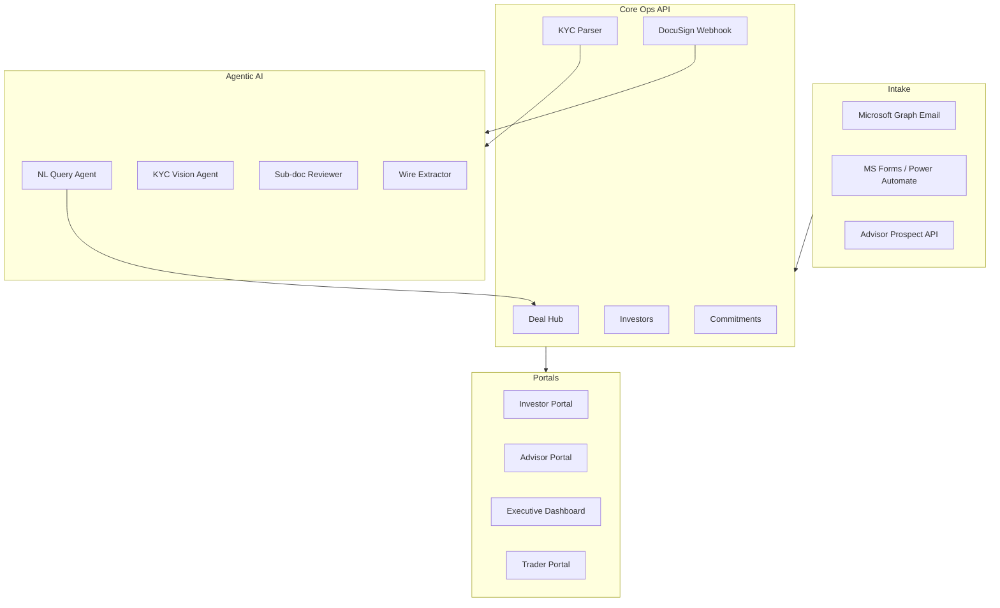

# Altvio — Alternative Investments Operations Platform

Open-source reference implementation of institutional alternative-investments operations: investor onboarding, KYC/AML, DocuSign-driven subscription docs, capital calls, distributions, multi-portal access, and agentic AI workflows for document extraction and natural-language data access.

**Built as a personal learning project** to explore multi-tenant SaaS patterns, agentic AI, and webhook-driven integrations in a regulated ops domain.

[](https://github.com/jamescotton2123/altvio/actions/workflows/ci.yml)

---

## Architecture



**Request flow (onboarding):** Intake email or form → AI parse → investor + commitment created → KYC upload (portal or SharePoint) → Vision agent → pending changes queue → DocuSign JWT send → mid-sign sub-doc reviewer → envelope complete → wire instructions + optional wire extraction.

---

## Highlights

- **Multi-tenant Postgres with Row-Level Security** — every operational table scoped by `firm_id`; RLS policies ready for JWT-scoped enforcement
- **120+ REST endpoints** — FastAPI monolith covering deal hub, commitments, KYC, billing, transfers, exec dashboard, and more
- **9 agentic AI workflows** — NL→SQL via allowlisted RPCs (no raw SQL), KYC parser, sub-doc compliance reviewer, wire instruction extractor, advisor desk insights, intake email parser, LOI sync, bank template learner, deal readiness
- **Webhook-driven integrations** — DocuSign Connect (HMAC + idempotent dedup), Microsoft Graph mailbox subscriptions
- **Hash-chained audit ledger** — tamper-evident `audit_logs` with SHA-256 chaining
- **Institutional patterns** — tenacity retry, structured JSON logging, bcrypt API keys, APScheduler background jobs

---

## Tech stack

| Layer | Tools |
|-------|-------|
| API | Python 3.11, FastAPI, Pydantic, uvicorn |
| Database | Postgres (Supabase), 42 SQL migrations |
| AI | OpenAI GPT-4o (function calling, Vision), Anthropic Claude (pluggable KYC engine) |
| Integrations | DocuSign eSign SDK, Microsoft Graph, Orion NAImport export |
| Ops | pytest, tenacity, APScheduler, python-json-logger |

---

## Quick start

### 1. Clone and configure

```bash
git clone https://github.com/jamescotton2123/altvio.git
cd altvio
cp .env.example .env
# Fill in Supabase URL + service_role key at minimum for local API
pip install -r requirements.txt
```

### 2. Apply migrations + seed (Supabase)

Apply all files in `supabase/migrations/` in filename order on a fresh Supabase project, then:

```bash
# In Supabase SQL editor
\i supabase/seed_dev_data.sql
```

Demo firm ID (from seed): `2cf19464-0fb6-460b-a283-09fab02d4ced`

### 3. Run the API

```bash
uvicorn api.main:app --reload
```

- Health: http://localhost:8000/health  
- Swagger UI: http://localhost:8000/docs  

### 4. Try the deal hub

```bash
curl -s -H "X-Firm-ID: 2cf19464-0fb6-460b-a283-09fab02d4ced" \
  http://localhost:8000/deals/active | jq
```

---

## Demo data (Dev RIA)

| Deal | Status | Narrative |
|------|--------|-----------|
| Meridian Growth Fund III | Active | Primary raise — funded + wire-pending commitments |
| Lakewood Credit Opportunities I | Active | Early-stage raise |
| Sequoia Opportunity Fund II | Closed | Distributions + notice readiness gaps |
| Harborview Real Estate LP | Closed | Historical fund |

10 investors across KYC states (Approved, Reviewing, Pending, Escalated) — designed to demo follow-up scheduler, KYC queue, and deal hub views.

---

## Project layout

```
api/           FastAPI routes (deals, commitments, portal, billing, …)
core/          Business logic, AI agents, integrations, schedulers
supabase/      SQL migrations + seed data
tests/         pytest suite (auth, audit, billing, webhooks, NL query)
scripts/       Orion export, seed utilities
```

---

## Tests

```bash
pytest tests/
```

---

## Deployment

See [DEPLOY.md](DEPLOY.md) for Fly.io + Supabase demo deployment.

---

## License

MIT — see [LICENSE](LICENSE).

---

## Author

James Cotton — investment operations background, self-taught backend engineer. Built Altvio to learn enterprise patterns in alt-investments ops.

**Not a commercial product.** No affiliation with any employer. Fictional seed data only.
